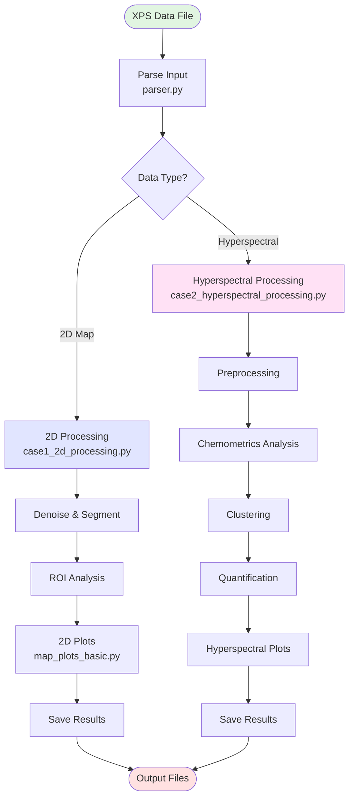
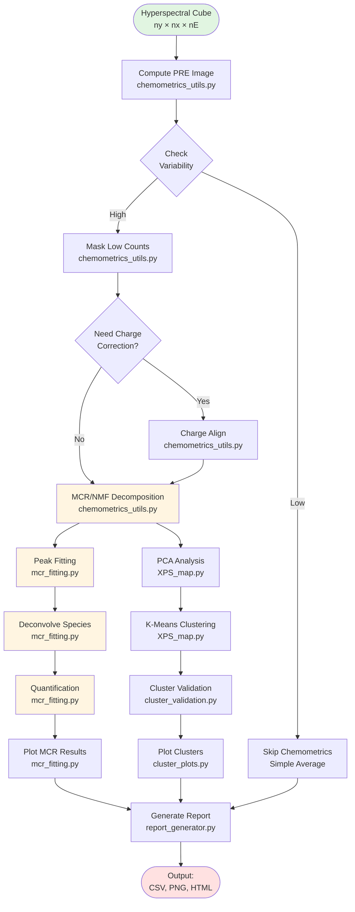
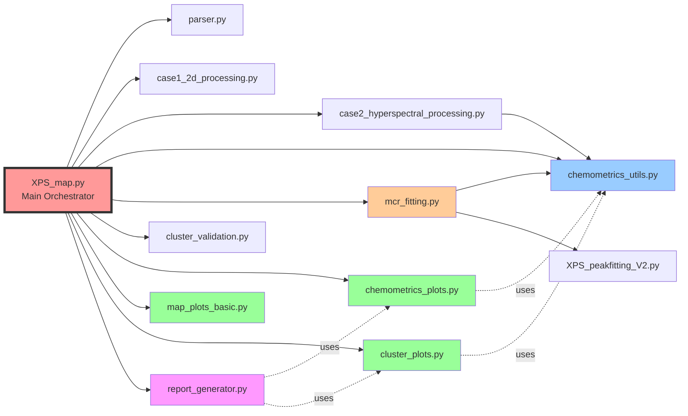
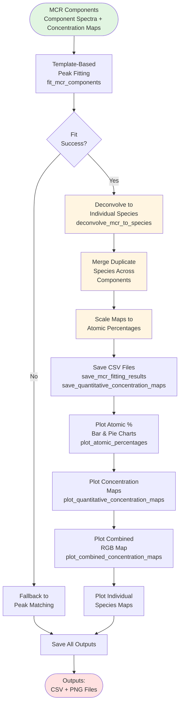
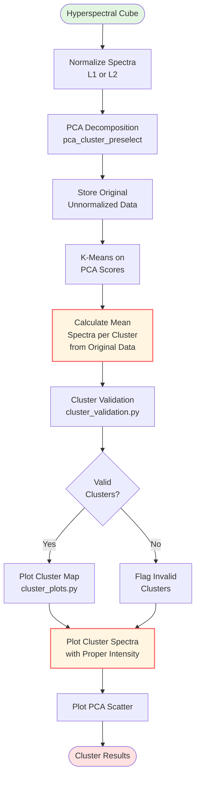
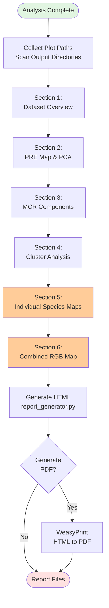
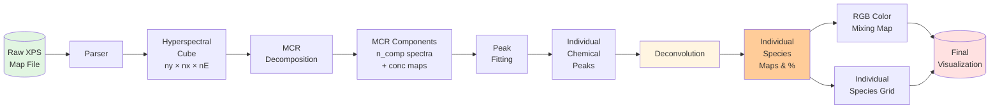
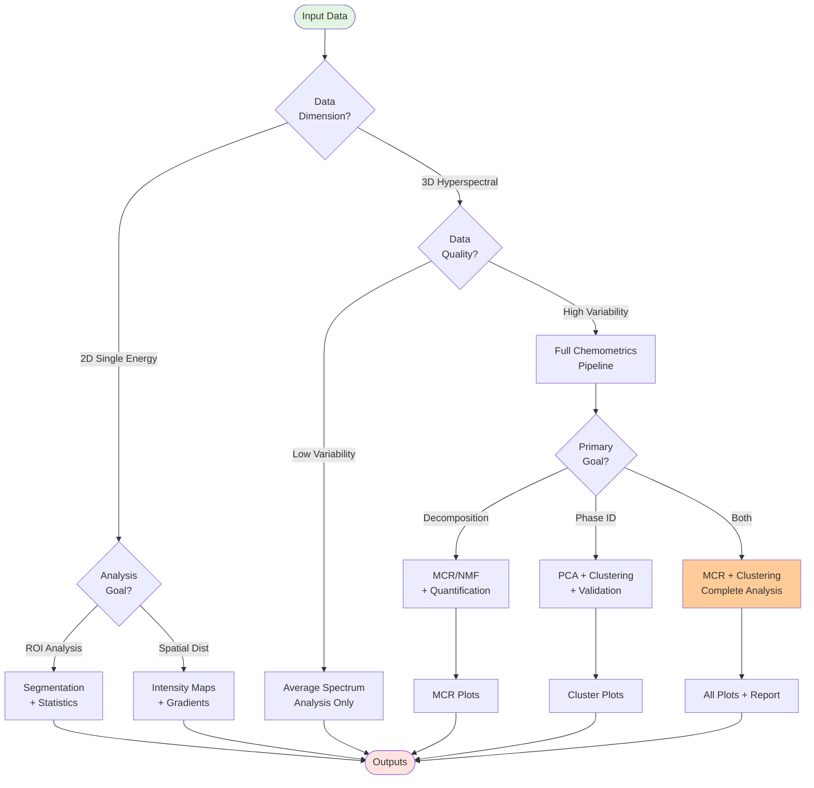

# XPS Map Processor - Architecture Flowchart

## Main Processing Pipeline



## Hyperspectral Processing Detail



## Module Dependencies



## MCR Fitting and Quantification Pipeline



## Cluster Analysis Pipeline



## Report Generation Pipeline



## Data Flow: From Raw to Quantified



## Workflow Decision Tree



---

## How to View These Flowcharts

### Option 1: GitHub/GitLab (Native Support)
- Push this file to your repository
- View directly in the web interface

### Option 2: VS Code (with Mermaid Extension)
```bash
# Install extension
code --install-extension bierner.markdown-mermaid

# Open this file
code ARCHITECTURE_FLOWCHART.md
```

### Option 3: Online Viewer
- Copy the Mermaid code blocks
- Paste into [Mermaid Live Editor](https://mermaid.live)

### Option 4: Export to PNG/SVG
```bash
# Install mermaid-cli
npm install -g @mermaid-js/mermaid-cli

# Generate images
mmdc -i ARCHITECTURE_FLOWCHART.md -o flowchart.png
```

---

## Flowchart Legend

| Shape | Meaning |
|-------|---------|
| Rectangle | Process/Function |
| Diamond | Decision Point |
| Rounded Rectangle | Start/End |
| Cylinder | Data Storage |
| Parallelogram | Input/Output |

| Color | Module Type |
|-------|-------------|
| Blue (#e1e5ff) | Processing Module |
| Pink (#ffe1f5) | Visualization Module |
| Yellow (#fff5e1) | Core Algorithm |
| Orange (#ffcc99) | Key Feature |
| Green (#e1f5e1) | Start Point |
| Red (#ffe1e1) | End Point |

---

## Key Insights from Flowcharts

1. **Two Main Branches**: 2D vs Hyperspectral processing are completely separate paths
2. **Modular Design**: Each major step is isolated in its own module for reusability
3. **Quality Gates**: Multiple decision points check data quality before expensive computations
4. **Recent Enhancements**: Cluster validation and species deconvolution are new critical steps
5. **Visualization Separation**: Plot generation is cleanly separated from computation
6. **Report Integration**: All analysis outputs feed into unified HTML/PDF reports
